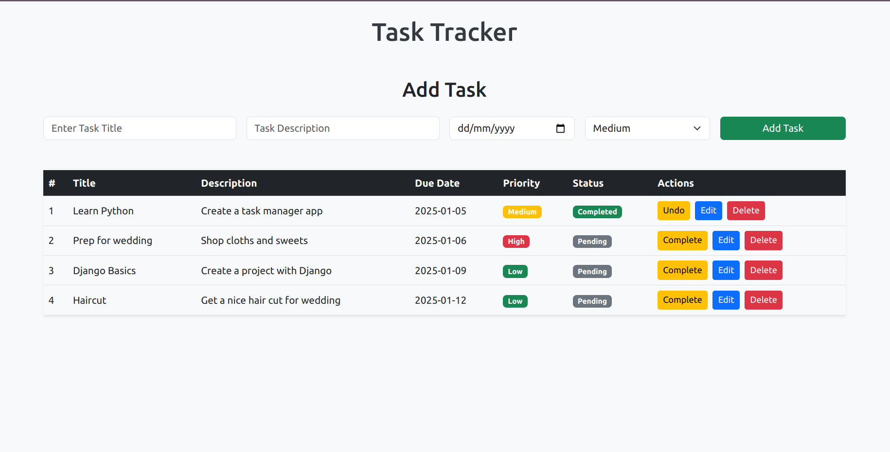
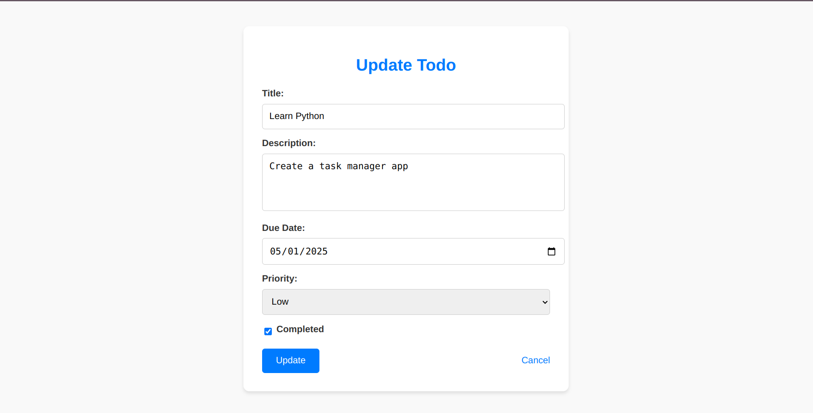

# Todo App

A simple web-based Todo application built using Python (Flask) and SQLite.

## Features

-   Add, update, and delete tasks.
-   Track the completion status of tasks.
-   Clean and responsive user interface using Bootstrap.

## Technologies Used

-   **Backend:** Flask (Python)
-   **Frontend:** HTML, CSS, Bootstrap
-   **Database:** SQLite

## Screenshots

### Home Page



### Update Task Modal



## Installation and Setup

Follow these steps to set up and run the application on your local machine:

### 1. Clone the Repository

```bash
git clone https://github.com/your-username/flask-todo-app.git
cd flask-todo-app
```

### 2. Create a Virtual Environment

```bash
python3 -m venv venv
source venv/bin/activate  # For Linux/Mac
venv\Scripts\activate  # For Windows
```

### 3. Install the Dependencies

```bash
pip install -r requirements.txt
```

### 4. Run the Application

```bash
flask run
```

### 5. Open in Browser

Visit the application at:

```bash
http://127.0.0.1:5000/
```

## Folder Structure

```bash
todo-app/
├── app.py           # Main application file
├── static/          # Static files (CSS, JS, images)
├── templates/       # HTML templates
├── requirements.txt # Python dependencies
└── README.md        # Project documentation
```

## Contributing

Contributions are welcome! If you find a bug or have a feature request, please open an issue. To contribute code:

1. Fork the repository.
2. Create a new branch for your feature or bug fix.
3. Commit your changes and push them to your fork.
4. Submit a pull request.

## License

This project is licensed under the MIT License. See the `LICENSE` file for details.

## Auther

Aman Dubey

